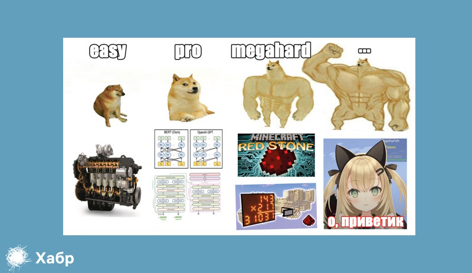
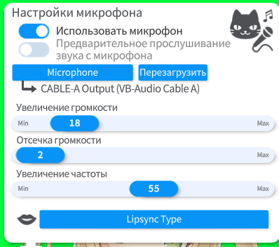
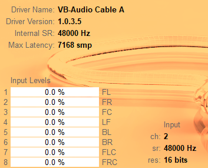
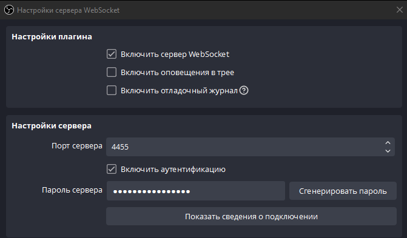

[](https://habr.com/ru/articles/812387/)

# NeuroDeva

Streams block game. Plays block game. Talking with people.


[](https://www.youtube.com/@NetTyan)
[](https://github.com/3ndetz/autoclef)
[](https://www.twitch.tv/neurodeva)

Automatic virtual streaming system. Completely autonomus.

Project name aliases: NeuroDeva, NetTyan

Languages: Python, Java ([for Minecraft-part](https://github.com/3ndetz/autoclef))

<details><summary>ML stack:</summary>

- NLP
  - Speech
    - TTS
    - STT
  - generative: T5 LLM
    - dialog system
  - classification: BERT (modified, multiple)
    - toxic detection
    - phrase type classification
- CV (MC captcha resolver)
  - keras-ocr
  - onnx
</details>

<details><summary>Some python packages</summary>

- torch
- multiprocessing
- multithreading
- flask
- websocket
- asyncio
- pysimplegui
- py4j
- sqlite
- tensorflow (a bit)
- and more, of course...
</details>

<details><summary>IDE and other software:</summary>

- JB PyCharm Community and Intellij Idea
- OBS
- VTube Studio
- Docker Desktop (WSL)
- Made on Windows 10
</details>

<details><summary>RepoCodeDisclaimer ⚠️</summary>
The "code" presented in the repository is mostly for prototyping. It should not be considered as a sample, it can be useful only to those who will be interested in repeating my experience, and not for "seekers of other people's mistakes" =)

The emphasis was on the fact that in the shortest possible time to make a project that can really impress someone and once again prove the fact that everything is possible 💪

In the code you can see huge commented out dumps, don't pay attention, because I had a choice to publish the code or not. I didn't format it in any way and didn't prepare it for publishing, so I didn't hesitate to leave crutches and other nasty things in there, like debug prints. However, I did format some things, but only the most attentive will notice this "feature".

</details>

## Коротко о главном

Полностью автоматическая виртуальная стримерша. Играет в Minecraft в мини-режим SkyWars. Общается с игроками и зрителями в реальном времени.

<div align="center">
	<a href="https://habr.com/ru/articles/812387/">
		
	</a>
</div>

Подробнее с проектом можно ознакомиться на [хабре](https://habr.com/ru/articles/812387/), здесь только общее описание технической части.

<div align="center">
	<a href="https://habr.com/ru/articles/812387/">
		
	</a>
</div>

## ФИЧИ

```
Это что-то вроде списка технологий, фич и содержания одновременно =)
```

<details><summary>Структура структуры 📘</summary>

Формат: Название - ([ссылки](#ФИЧИ)) - _связанные файлы в репозитории, путь_

Ссылки:
- ([хабр](https://habr.com/ru/articles/812387/)): соответствующий раздел статьи на Хабре для подробностей по разработке (для удобства в ней также есть своя [навигация](https://habr.com/ru/articles/812387/#Portal)). 
- (репо): ссылка на другой репозиторий в GitHub
</details>

[Проскочить раздел](#инструкция-по-установке-и-запуску)

---

- Бот для автоматической игры - ([хабр](https://habr.com/ru/articles/812387/#CodeDisclaimer)) - _([репо](https://github.com/3ndetz/autoclef))_ + _HyperAI_BRIDGE.py_
   - Java-часть: ([репо](https://github.com/3ndetz/autoclef)) ([хабр](https://habr.com/ru/articles/812387/#CodeDisclaimer))
   - HyperAI_Bridge: сетевой мост между главным Python-скриптом и Java-ботом
   - Собственный ИИ для распознавания MC-капчи ([репо](https://github.com/3ndetz/MapResolverMC)) ([хабр](https://habr.com/ru/articles/812387/#MCMapCaptchaSolver)) ([потыкать на HF space](https://huggingface.co/spaces/3ndetz/mc_map_resolver))
   - <details><summary>Гифка: сбор ресурсов с побеждённого игрока</summary>
         
      </details>
- Виртуальный аватар: VTube Studio - _HyperAI_VTube_
   - Live 2D: LiveroiD (автор разрешает использование для проведения трансляций)
   - Связь аватара с игрой и речью: эмоции, взгляд - ([хабр](https://habr.com/ru/articles/812387/#MineEyeBridge)) - _HyperAI.py + HyperAI_BRIDGE.py_
   - <details><summary>Гифка: аватар поворачивает взгляд в сторону цели игрового бота</summary>
         
      </details>
- Синтез речи - ([хабр](https://habr.com/ru/articles/812387/#AnotherCode)) - _HyperAI.py/TTS_PROCESS_
   - Silero TTS ([silero-models](https://github.com/snakers4/silero-models))
   - Realtime субтитры в OBS через веб-приложение на Flask ([хабр](https://habr.com/ru/articles/812387/#AnotherCode))
   - "Проброс" звука в OBS через virtual audio cable ([хабр](https://habr.com/ru/articles/812387/#AnotherCode))
- Наложение динамических элементов в OBS 
   - Элементы передаются и обновляются в OBS через веб-приложение на Flask ([хабр](https://habr.com/ru/articles/812387/#AnotherCode))
   - Элементы: индикатор настроения и псевдосинхронизированные субтитры ([хабр](https://habr.com/ru/articles/812387/#AnotherCode))
- Диалоговая система - ([хабр](https://habr.com/ru/articles/812387/#ChatSystem)) - _HyperAI_Models/LLM_
   - RAG-like подход ([хабр со всеми схемами](https://habr.com/ru/articles/812387/#ДиалоговаяСхема))
   - <details><summary>Пикча схемы сборщика промпта (абстрактно)</summary>
         
      </details>
   - <details><summary>Хранение постоянных данных с помощью sqlite</summary>
         
      </details>  
     
     _HyperAI.py + HyperAI_Database.py_
   - LLM - FredT5 (на Docker) ([Почему он? Ответ на хабр!](https://habr.com/ru/articles/812387/#GptCry))
   - Фильтры ИИ: токсичность, запретные темы ([хабр](https://habr.com/ru/articles/812387/#ФильтрацияДемо)) - _HyperAI_Models/Filters_
   - Обычный list-like фильтр на самые "опасные" слова - _HyperAI_Models/Filters_
- Распознавание речи - ([хабр](https://habr.com/ru/articles/812387/#AnotherCode)) - _HyperAI_Models/STT/docker_to_send_
   - Docker-based
   - Модель: Nvidia fastconformer hybrid large ([HF](https://huggingface.co/nvidia/stt_ru_fastconformer_hybrid_large_pc))
- Подключение к социальным сетям - чтение чата и публикация ответов ([хабр](https://habr.com/ru/articles/812387/#AnotherCode))
   - youtube-data-api
   - twitch-api
   - trovo-api
   - discord-bot-api ([pycord](https://pycord.dev/))
- Связующая система - _HyperAI.py/..._
  - Система выбора релевантного вопроса - _.../ChooseQuestion_
    - здесь сходятся все полученные сообщения и в приоритет ответа выбирается наиболее релевантный и наименее "агрессивный" вопрос
  - Система синхронизации между процессами
    - (multiprocessing.namespace)
  - Система автоматического принятия решений - _.../CentralDecisionMaker/..._
    - объявления - доклад "статуса", интересные (или не очень) факты, приветствия зрителей - _.../BroadcastProcesser_
    - реакция на внутриигровые события (убийство/смерть) - _.../EventProcesser_
    - реакция на пожертвования DonationAlerts - _.../DonateProcesser_
    - ответы в чате _.../CentralChatProcesser_
  - Оболочка диалоговой системы -  _.../FredT5Chatbot_
  - Панель управления
    - Консольное приложение для отладки конкретных функций
    - PySimpleGui-окно с доступом к основным функциям

---

## Инструкция по установке и запуску
```⚠️раздел находится в доработке⚠️```
```👨🏻‍💻инструкция не для начинающих👨🏻‍💻```

Это просто краткий гайдлайн, настоящая инструкция будет делаться позже если будет востребована. Подробности некоторых моментов можно вычерпнуть из [хабра](https://habr.com/ru/articles/812387/).

<details><summary>🖥️ ▷ Системные требования</summary>

| Характеристика                     | Рекомендуется | Минимально |
|------------------------------------|---------------|------------|
| ОС                                 | Windows       | -          |
| ОЗУ                                | 48            | 16         |
| Видеопамять                        | 24            | 4          |
| Версия Python                      | 3.9.7         | -          |
| Дополнителньое <br/>место на диске | 60 Гб         | 30 Гб      |

    При любых других характеристиках ПК работа автоматической системы не гарантирована.

</details>

```Пометка 🚧 означает неготовность раздела```

1. <details><summary>Установка игрового клиента</summary> 
   
   1. Установите Minecraft версии 1.18 и скачайте [последний релиз](https://github.com/3ndetz/autoclef/releases) Java-бота. 
   2. Установите загрузчик модов [Fabric](https://minecraft-inside.ru/mods/94668-fabric.html) для вашего Minecraft. 
   3. [Переместите](https://docs.fabricmc.net/ru_ru/players/installing-mods) .jar файл в папку .minecraft/mods. 
    </details>

2. <details><summary>Виртуальный аватар</summary> 
    
    1. Начало: установка модели
       1. Установите VTubeStudio, например, со [Steam](https://store.steampowered.com/app/1325860/VTube_Studio/).
       2. Установите модель, которая вам понравится. Автор использовал LiveroID, куча крутых моделей есть в Steam Workshop, можно ставить прямо оттуда.
       3. [Выберите нужную модель](https://www.yandex.ru/search/?text=%D0%BA%D0%B0%D0%BA+%D0%B2%D1%8B%D0%B1%D1%80%D0%B0%D1%82%D1%8C+%D0%BC%D0%BE%D0%B4%D0%B5%D0%BB%D1%8C+vtube+studio&lr=62) в VTube Studio.
    2. Установка взаимодействия с Python-скриптом.
       1. Включите VTube Studio Plugins API на порте 8001.
          - Позже, при запуске главного скрипта, вам нужно будет разрешить подключающийся к VtubeStudio плагин "test", выйдет диалоговое окно.
       2. Настройте липсинк
          1. Установите настройки, у меня такие:
          2. 
          3. Выберите устройство звука, через которое будет проходить выводиться TTS вашего персонажа. 
             - Я использовал виртуальный аудио кабель, но с помощью него надо пробросить звук по пути tts процесс-vtube-obs
    </details>
3. <details><summary>Проброс звука через виртуальный кабель</summary>  
   
   1. Установите виртуальный кабель, например, [VB-Audio](https://vb-audio.com/Cable/VirtualCables.htm) и перезагрузитесь
      1. Установите в настройках виртуального кабеля (всех возможных, и в разделе динамиков, и в разделе микрофона) пресет "2 канала, 16 бит, 48 000 Гц".
         - Если на Windows, то настройки будут в панели управления звуковыми устройствами
         - В любом случае надо изменить настройки и в самой программе кабеля. На Windows она обычно устанавливается в _Диск/Program Files/VB/CABLE-A/VBCABLE_ControlPanel.exe_
           
         - 
      2. По умолчанию этот скрипт заточен под VB-Cable A.
         - Если вы не устанавливали несколько кабелей, вам придётся в HyperAI.py сменить имя звукового устройства на то, которое используете вы для проброса звука.
   </details>
4. <details><summary>Настройка стриминговой программы</summary>  
   
   1. Для проведения трансляций скачайте и установите [OBS](https://obsproject.com/).
   2. Создайте 2 сцены - NetTyan и NetTyanDisclaimer.
      - они нужны для корректной работы главного скрипта
   3. В настройках аудио OBS выберите ранее настроенное и выбранное аудиоустройство
   4. Выведите персонажа на экран добавив источник вебкамера/VTubeStudioCam
   5. Добавьте субтитры с помощью источника "Браузер". В поле URL вбейте - http://localhost:5000/subtitles/
   6. Аналогично добавьте значки состояния системы: http://localhost:5000/info/
   7. Установите оставшиеся настройки OBS - ключ для трансляций, отрегулируйте звук на ваше усмотрение и т.д.
   8. Для поддержки функций управления трансляцией из скрипта включите OBS WebSocket Server: Сервис/Настройка сервера WebSocket.
      - Установите пароль и порт, и введите их в HyperAI_OBS.py.
         
   </details>
5. <details><summary>Подготовка главного скрипта Python</summary>
   
   1. Клонируйте (скачайте) этот репозиторий (github.com/3ndetz/NeuroDeva) - в любую папку на диске.
   2. Установите все зависимости Python из requirements.txt (лежит в корневой папке репозитория).
      - Для этого у вас должен быть установлен Python
        - Идеальная версия - 3.9.7, на ней работал автор
      - Автоматизировать скачку и установку библиотек вы сможете, используя IDE PyCharm Community для открытия этого репозитория.
        - В нём же автор запускал итоговую программу
        - Тип проекта в PyCharm выбирайте "venv", место для папки библиотек - корневая папка репозитория.
        - Версия Python: 3.9.7 (оптимальная)
   3. Отредактируйте затравки в HyperAI_Models/LLM/...
      1. Переместите из папки .../PROMPTS_HELP эти файлы в папку выше (LLM):
      2. .../LLMExamples.py
      3. .../prompts.py
      4. Отредактируйте string'и в .../prompts.py в соответствии со своими предпочтениями для затравки диалоговой модели.
      5. Используйте 2 символа "#" для активации перетусовочного механизма.
         - Например, текст "#игривый лось#" при выдаче модели будет рандомно перетусован в один из двух вариантов:
           - "игривый лось"
           - "лось игривый".
      6. Отредактируйте большие string'и в .../LLMExamples.py аналогично (вашим предпочтениям)
   4. Изменение переменных (конфигурация)
      1. Поменяйте список ников в HyperAI.py/botNicknames на те, которые ваш персонаж будет использовать в игре и в социальных сетях
      2. Создайте в корневой папке репозитория файл HyperAI_Secrets.py и добавьте туда строковые переменные DiscordToken, DockerAuthKey, TrovoClientID, TrovoAccessToken, Razrabs и OBS_WS_PASSWORD.
      3. Создайте в папке HyperAI_Docker/other файл HyperAI_DockerSecrets.py и введите туда DockerAuthKey = b"ваш_пароль_к_docker". То же значение той же переменной установите в HyperAI_Secrets.py из предыдущего шага.
   </details>

6. <details><summary>Подключение к социальным сетям (раздел не готов 🚧)</summary>

    Если кратко, то надо открыть разраб панель в google dev console, discord. В гугл подключить youtube-data-api-v3, получить все секретные токены закинуть их в папку HyperAI_Social/youtube. В той же папке + HyperAI_YT сменить все токены/id каналов на свои. Подробнее распишу позже, если это понадобится!
   </details>
7. <details><summary>LLM и STT - Docker (раздел не готов 🚧)</summary>

   1. Скачайте и установите Docker Desktop. Если вы на Windows, включите в нём поддержку WSL (загуглите, если не найдёте в настройках).
   2. Отдельно запустите с помощью Python файл HyperAI_Docker.py и дождитесь окончания работы скрипта. Он установит нужный Docker-контейнер.
   </details>
8. <details><summary>Запуск главного скрипта (раздел не готов 🚧)</summary>
    
   1. Убедитесь, что все предыдущие шаги настройки выполнены в полном объёме.
   2. Запустите Minecraft 1.18 с установленным клиентом. Установите ваш ник, который вы указали в коде ранее.
   3. Запустите Python-скрипт HyperAI.py и дождитесь открытия меню
   </details>
9. <details><summary>Запуск трансляции (раздел не готов 🚧)</summary>
   
   1. Выполните все шаги из предыдущего пункта "Запуск главного скрипта"
   2. Подключитесь к нужному серверу Minecraft с запущенного клиента
      - Полностью автоматическая игра в SkyWars поддерживается на данный момент только на MusteryWorld, но там новая капчу, придётся её ввести вручную
      - Вы можете использовать другие сервера со SkyWars с запуском вручную:
        - подключайтесь к нужной игре
        - дожидайтесь запуска
        - вводите команду @test killall для включения терминатора
   3. Запустите стриминговую программу OBS и убедитесь, что всё работает
   4. Нажмите кнопку запуска в gui-окне скрипта
   </details>


---
3ndetz, 2023-2024
